# UK Rides Review Hub (A theme park database and reviews site)

For my Milestone 3 project I am creating a reviews site for theme parks on a database using MongoDB.

The project is a website where users can submit theme park ride reviews to the website using CRUD functionality. There is an all rides page where users can search for rides, and there are also individual theme park pages where it shows just the rides for that particular theme park, this is all via a "Theme Parks" dropdown tab in the navbar. There is also a write a review page, and a view all reviews page via a "Reviews" dropdown tab. As well as writing a review for a ride via the write a review page, you can also write a review via each indivdual ride modal on the theme park pages. 

Live Link:
https://theme-park-reviews-website-f1f235eaa19d.herokuapp.com/

# UX

## Wireframes

Home Page - Mobile

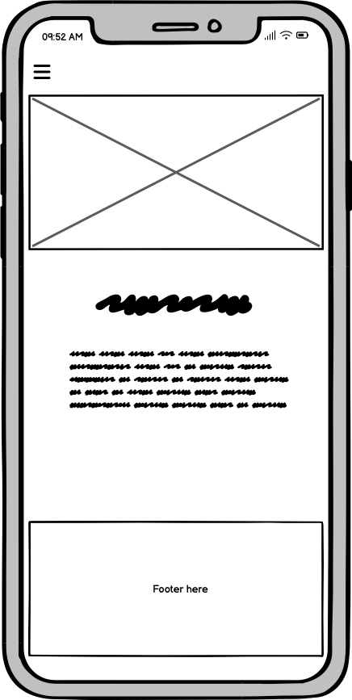

Home Page - Desktop

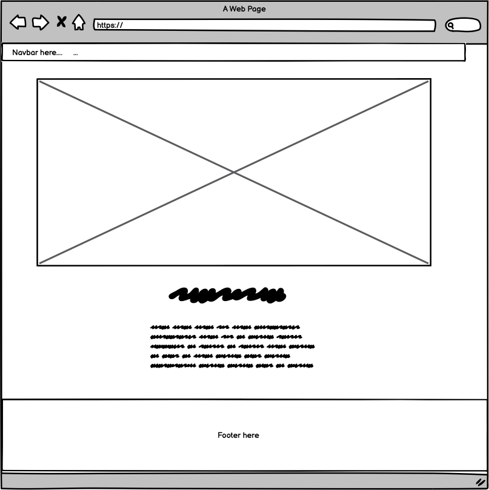

Rides Page - Mobile

Rides Page - Desktop

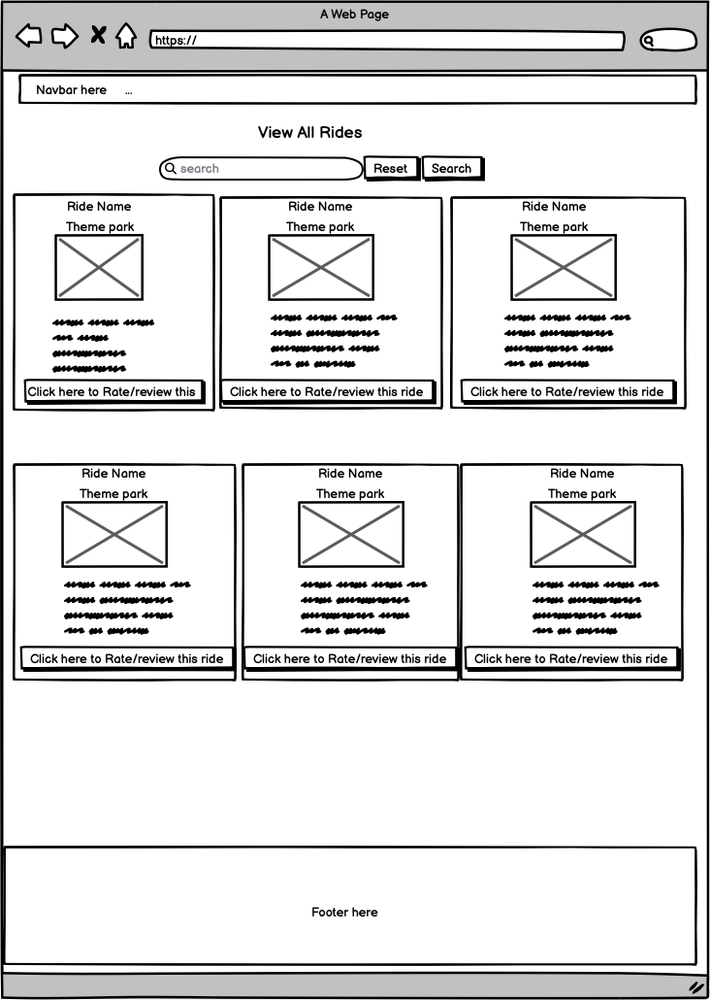

Registration Page - Mobile

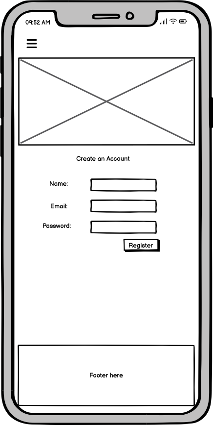

Registration Page - Desktop

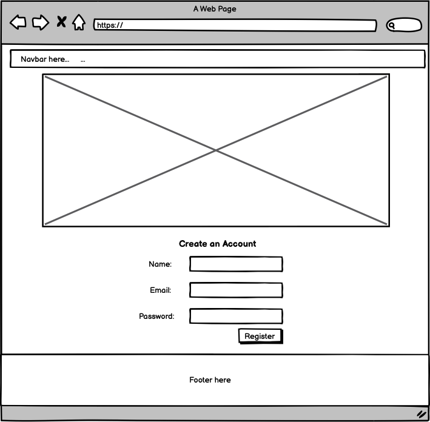

Login Page - Mobile

Login Page - Desktop

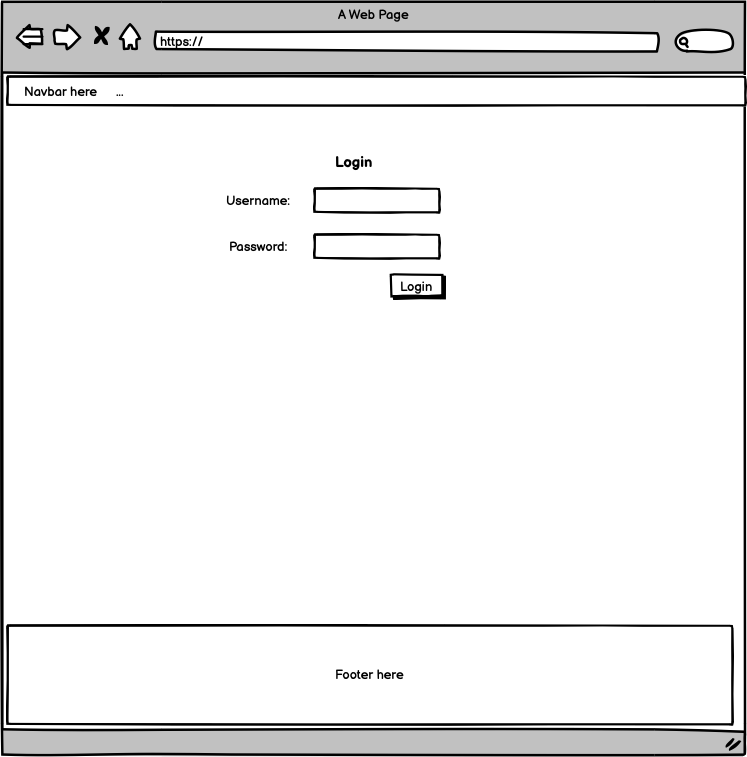

Ratings/Review Form (Via a modal in each ride container, similar for all screen sizes)

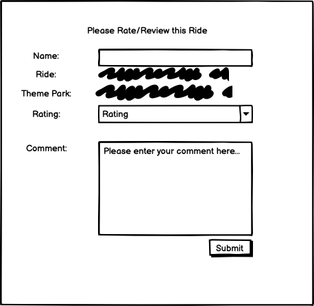

Write a Review Page - Mobile

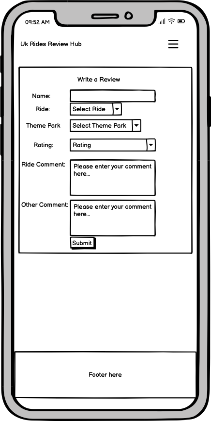

Write a Review  Page - Desktop

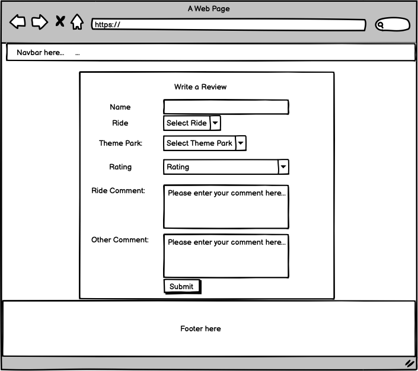

Reviews Page - Mobile

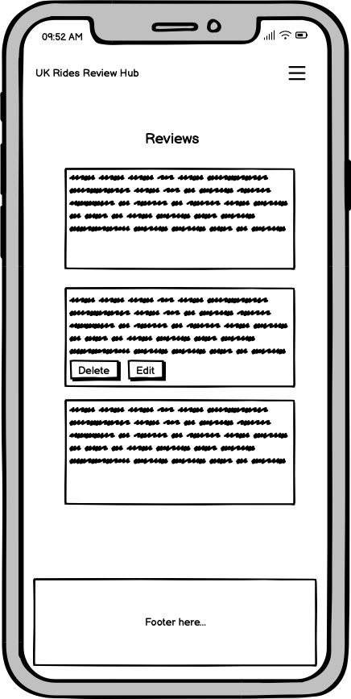

Reviews Page - Desktop

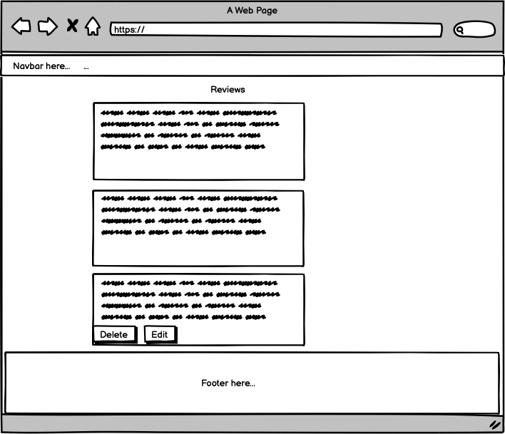

## User Stories

* As a user I should be able to find out the purpose of the website and what it is about from the home page.
* As a user I should be able to see a list of rides and on the 'View all rides' page and search for them.
* As a user, I shouldn't be able to submit a review unless I am logged in.
* As a user I should be able to write a review on the 'Write a Review' Page and be able to submit it.
* As A user, I should be able to write a review via the ride modals and it should submit and post it to the reviews page.
* As a user on the 'Reviews' page, I should be able to add, edit or delete my own review/s.
* As a user on the 'Reviews' page, I shouldn't be able to edit reviews other than ones of my own.
* As a user, I should be able to read all the reviews on the reviews page.
* As a user I should be able to register an account.
* As a user I should be able to login to my account.
* As a user I expect the website to be responsive on a range of screen sizes so I am view it on different devices.

##  Database Schema

Please see below the Database Schema screenshot for my project. I used MongoDB Database to build my project with.

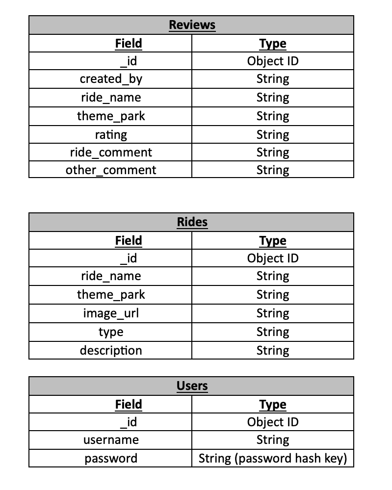

As you can see some fields are related to each other. Some have the same fields, such as ride names and theme parks and are in both the Reviews and Rides collections. Users are also connected to reviews as users write a review. Rides are connected to reviews as it contains some of the same fields and values. 

One field in two different collections have different field names but actually have the same values. It was 'created_by' in the Reviews collection and 'username' in the Users collection. They both contain the same username as a value but it made more sense on the Reviews page on the webesite to show 'created_by', and 'username' on the Register and Login pages.

# Technologies Used
* HTML
* CSS
* Bootstrap Framework
* Python
* Flask Framework

# Features

## Home Page

This page is an home page which has an image of Blackpool Pleasure Beach with a beach in the background and introduces what the website is about.

## View all Rides page

This page features all the rides on. There is a search bar that you can use to search for rides which makes it easier for the user to filter down to the ride they want to see and review. The page used Bootstrap card elements in a grid format and features a pop-up modal where you can fill out a review for that particular ride and then it gets submitted to the reviews page. It can only be submitted if a user is logged in. In the future if more rides are added to the website then pagination could be used to enhance the user experience.

## Individual Rides pages for the individual theme parks.

Works similar to the 'View all Rides page" mentioned above but doesn't have a search bar there. These individual pages are for each theme park. If more rides got added to these pages then a search bar could be added at a later stage. They also feature a pop-up modal for a review for each ride.

## Write a Review page

This page is a page for users to write a review. This is separate from the ride modal pop-up review form. If a user enters a website I thought it was a good idea to have a separate review page as well as the review from via the pop-up modals in the ride containers. Users cannot submit a review unless they are logged but they can fill out a form. If a user fills out a form and submits it if not logged it re-directs the user to the Login Page.

## Pop up modal ride review page

Similar to the above.

##  View all Reviews Page

The reviews page is a page where all the reviews are shown that users submit. There is an option on there to edit and delete reviews. If you click on the edit button it takes you back to the write a review page and you can re-fill out the review form and it automatically edits on the review page. Only users who are logged in can edit or delete their own reviews. 

## Registration Page

This is a page where users can register for creating an account with.

## Login Page

This is a page where users can login to their account. There is an option from this page to link to the register page if you aren't already registered.

## Profile Page

A profile page that shows when the user is logged in to the website.

## Navbar

This is the navbar which has the links to the relevant pages on the website. 

## Footer

This is the footer that contains the logo and the social links.

## Future Features

- Add more rides and theme parks to the website.
- As more rides and theme parks are added in to the website, then I could add in search functionality for each theme park.
- A pop-up asking if confirm if you want to delete a review, or edit a review before actually doing it.
- Add in pagination for if there a large number of rides on a page.
- Admin page via website to add, edit, and delete rides rather than directly on MongoDB database.
- Make the profile page for users and admin when logged in more attractive.
- Show users own reviews to their profile page.

# Testing

## Bugs 
### Fixed Bugs
- When submitting a review via the ride modals to begin with, the ride and theme park names didn't show up/transfer over to the reviews page, and said none. I tried doing an inner for loop with Jinja for reviews within the relevant parts in the forms, but then the ride and theme park names didn't show up in the modal review forms, I also tried slightly amending other bits of Jinja to 'reviews.ride_name' rather than 'rides.ride_name' in the forms but that didn't solve the problem either.  After debugging it and finding out the issue with ChatGPT, it mentioned about adding in hidden input form fields for everything affected so I added that in. I looked up the official documentation afterwards of hidden input form fields to clarify my understanding of it.
- The other small issue affected by the above was I had to decided to amend a key, which I altered in the app.py file, from ride to ride_name so it was consistent for both reviews, and the rides collections. I also had to change this manually on the MongoDB website, and in the relevant template files as well.
- When submitting the form it went to the 'Write a Review' page instead of the page where all the reviews were shown. I fixed this issue by amending the route name next the 'POST' method in the action bit in the relevant templates files to 'get_reviews' instead of add_review. This solved the issue, and it made it a better user experience.
- Problem where other users submitting reviews didn't submit to the reviews page. I first discovered this via a Peer Code Review channel on Slack. It was fixed by checking and amending odd variable names, making sure it matched in the app.py files and also amending routes in odd files in the templates folder. I also created a second user account for myself to check this bug was fixed.

### Unfixed Bugs
- When first entering the website, the images can take a few seconds to show on the ride pages. This may be because of it being a url for images which I used on the MongoDB website. 

## Validation
I have been using the HTML, CSS and Python validators to validate my code.

# Credits and Acknowledgements

## Credits

### General

* [Canva](https://www.canva.com/) - or creating and designing the logo

* [Balsamiq](https://balsamiq.com/wireframes/) - for creating the wireframes

* [Gitpod](https://www.gitpod.io/) - For working/completing on my project

* [Github](https://github.com/) - To store my project online

* [MongoDB](https://www.mongodb.com/) - To store the database info on

* [Heroku](https://id.heroku.com/login) - For deploying the project and storing the env variables.

* [RandomKeyGen](https://randomkeygen.com/) - For generating secret key contained in the env file.

* [Rgb color code website](https://rgbcolorcode.com/) - For choosing colours

* [Readme Markdown](https://github.com/adam-p/markdown-here/wiki/Markdown-Cheatsheet#links) - For markdown documentation for the ReadMe

* [ChatGPT](https://openai.com/index/chatgpt/) - For general debugging and spotting basic errors.

* [Claude AI](https://claude.ai/new) - For general debugging and spotting basic errors.

### Images

* [Wikimedia Commons](https://commons.wikimedia.org/wiki/Category:Images) - For the home image and all the ride images

* [Font Awesome](https://fontawesome.com/icons) - For the icons used for the social links in the footer

### Validators

* [HTML Validator]() - HTML Validator

* [CSS Validator]() - CSS Validator

* [PEP8 Python Validator]() - Python Validator

### Content/Documentation

* For sorting out the whitespace under the footer issue I used some of the code on [this webpage](https://www.30secondsofcode.org/css/s/footer-at-the-bottom/). The website is called the 30 seconds of code website and the page is about the footer being on the bottom.

* [W3 schools](https://www.w3schools.com/) - For general documentation

* [Bootstrap](https://getbootstrap.com/docs/5.3/getting-started/introduction/) - For the relevant documentation

* [Hidden Input Fields ](https://www.w3schools.com/tags/att_input_type_hidden.asp) - When submitting the form and some of the fields didn't transfer over to the reviews page, advised by ChatGPT.

* All content about the Theme Park rides on the website were written myself and from Google from my knowledge of visiting these theme parks in the past. 

## Acknowledgements

A big thanks to the support from my mentor at the Code Institute, my facilitator at the City of Bristol College, and the Code Institute Slack Community and Tutor Support for assistant on my Milestone 3 project.

# Deployment

Please find the steps below to deploy to Heroku.

Install the following in your terminal first in VS Code/Gitpod.
- pip3 freeze --local > requirements.txt
- echo web: python app.py > Procfile

You can check these have been added by looking at your files on the left hand side in VS Code/Gitpod.

 Go to Heroku.com and implement the following stepsin this order:
 - On the home page, click 'New' and in the dropdown, click on 'Create a new app'.
 - Add app name (This name must be unique, and have all lower case letters. Also use minus/dash signs instead of spaces.)
 - Select Region  (Select the most relevant region, mine is Europe)
 - Click the button that says 'Create App'.
 - Click on the Deploy tab near the top of the screen.
 - Where is says Deployment Method click on Github.
 - Below that, search for your repo name and add that.
 - Click connect to the app.

 Before clicking below on enable automatic deployment do the following:
 - Click on the settings tab
 - Click on reveal config vars.
 - Add in your variables from your env. files as key value pairs. (These are the IP, Port, Secret-Key, Mongo-URI (Won't  have connected to the Mongo-URI yet at this point), Mongo-DBName). Mongo-URI can be added at a later stage.
 - Go back and click on the Deploy tab. 
 
 Before the app can be connected, push the following new files below to the repository. Go back in the terminal in your coding environment and add the following:
 - git status
 - git add requirements.txt
 - git commit -m "Add requirements.txt file"
 - git add Procfile
 - git commit -m "Add Procfile"
 - git push

 Head back over to Heroku where the Deploy tab is.
 - Click 'Enable Automatic Deploys'
 - Click Deploy Branch. (Should be a main or master branch)
 - Heroku will receive code from Github and build app with the required packages. Hopefully once done the 'App has successfully been deployed message below' will appear.. 
 - Click 'View' to launch the new app.

The app has been successfully deployed now and it should automatically update any changes made to our code in GitHub. The deployed link to this project is https://theme-park-reviews-website-f1f235eaa19d.herokuapp.com/

 
