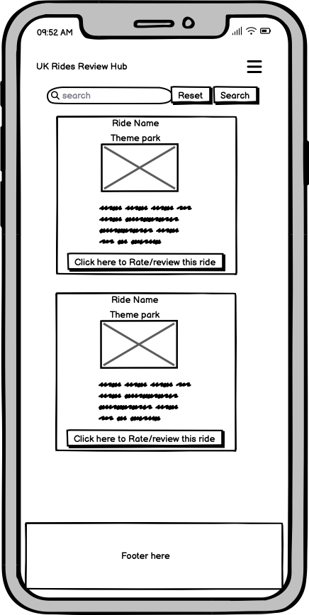
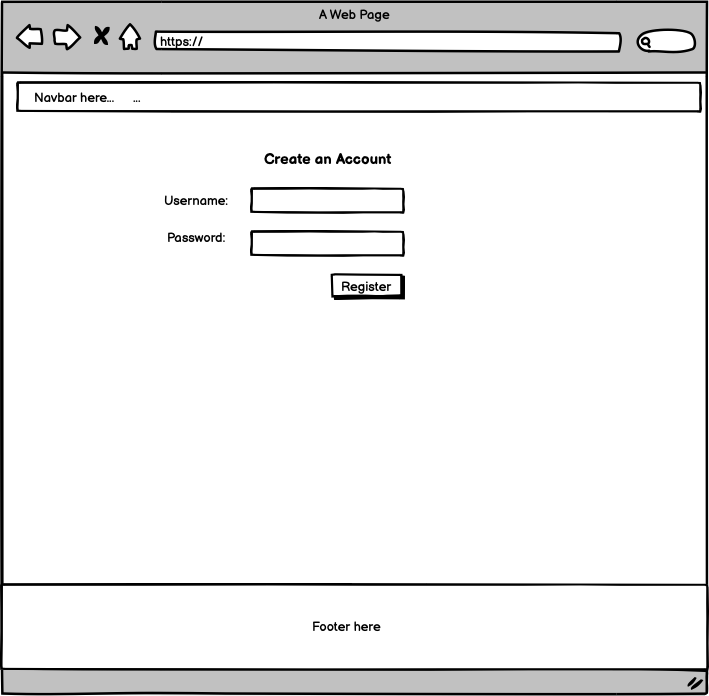
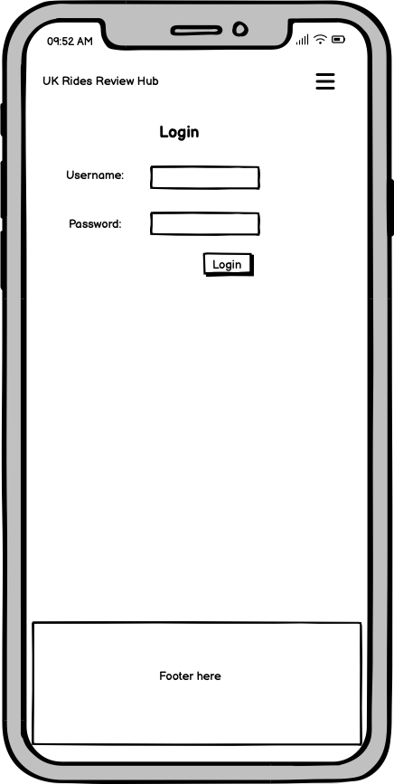

# UK Rides Hub (A theme park database and reviews site)

For my Milestone 3 project I am creating a reviews site for theme parks on a database using Mongodb.

# UX

## Wireframes

### Home Page - Mobile

### Home Page - Desktop

### Rides Page - Mobile

### Rides Page - Desktop

### Registration Page - Mobile

### Registration Page - Desktop

### Login Page - Mobile

### Login Page - Desktop

### Ratings/Review Form (In the form of a Modal, similar for all screen sizes)

## User Stories

* As a user I should be able to find out the purpose of the website and what it is about from the home page.
* As a user I should be able to see a list of rides and search for them on the rides page.
* As a user, on each ride container I should be able to click open a link to a modal with rating/reviewing rides form for it to be submitted to the database and the reviews should available to read on the website somewhere.
* As a user I should be able to register an account.
* As a user I should be able to login to my account.
* As a user I expect the website to be responsive on a range of screen sizes.

# Deployment

Please find the steps below to deploy to Heroku.

Install the following in your terminal first in VS Code/Gitpod.
- pip3 freeze --local > requirements.txt
- echo web: python app.py > Procfile
 You can check these have been added by looking at your files on the left hand side in VS Code/Gitpod.

 Go to Heroku.com and implement the following stepsin this order:
 - On the home page, click 'New' and in the dropdown, click on 'Create a new app'.
 - Add app name (This name must be unique, and have all lower case letters. Also use minus/dash signs instead of spaces.)
 - Select Region  (Select the most relevant region, mine is Europe)
 - Click the button that says 'Create App'.
 - Click on the Deploy tab near the top of the screen.
 - Where is says Deployment Method click on Github.
 - Below that, search for your repo name and add that.
 - Click connect to the app.

 Before clicking below on enable automatic deployment do the following:
 - Click on the settings tab
 - Click on reveal config vars.
 - Add in your variables from your env. files as key value pairs. (These are the IP, Port, Secret-Key, Mongo-URI (Won't  have connected to the Mongo-URI yet at this point), Mongo-DBName). Mongo-URI can be added at a later stage.
 - Go back and click on the Deploy tab. 
 
 Before we can connect it we need to push new files to the repository. Back in the terminal in your coding environment we need to add the following in the terminal:
 - git status
 - git add requirements.txt
 - git commit -m "Add requirements.txt file"
 - git add Procfile
 - git commit -m "Add Procfile"
 - git push

 Head back over to Heroku where the Deploy tab is.
 - Click 'Enable Automatic Deploys'
 - Click Deploy Branch. (Should be a main or master branch)
 - Heroku will receive code from Github and build app with the required packages. Hopefully once done the 'App has successfully been deployed message below' will appear.. 
 - Click 'View' to launch the new app.

Your app has been successfully deployed now at this point and should automatically update everytime we make changes to our code in GitHub. The deployed link to this project is https://theme-park-reviews-website-f1f235eaa19d.herokuapp.com/

 
