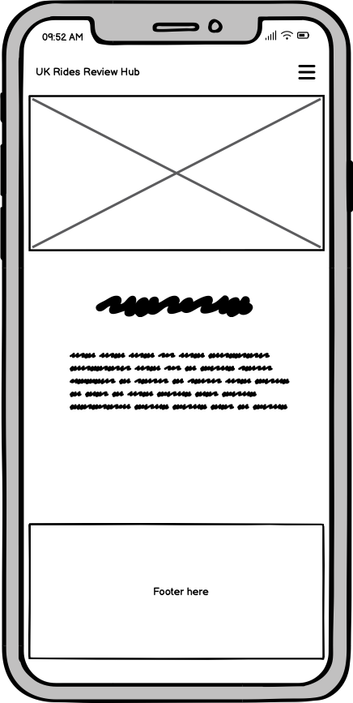
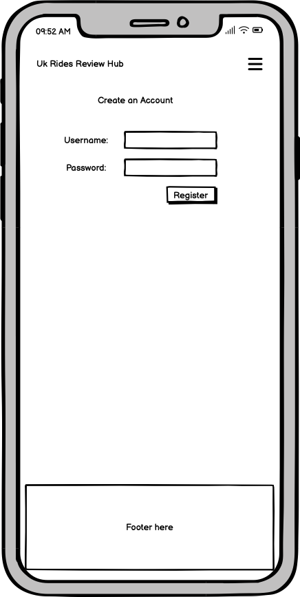

# UK Rides Hub (A theme park database and reviews site)

For my Milestone 3 project I am creating a reviews site for theme parks on a database using Mongodb.

# UX

## Wireframes

### Home Page - Mobile

### Home Page - Desktop

### Rides Page - Mobile

### Rides Page - Desktop

### Registration Page - Mobile

### Registration Page - Desktop

### Login Page - Mobile

### Login Page - Desktop

### Ratings/Review Form (In the form of a Modal, similar for all screen sizes)

## User Stories

* As a user I should be able to find out the purpose of the website and what it is about from the home page.
* As a user I should be able to see a list of rides and search for them on the rides page.
* As a user, on each ride container I should be able to click open a link to a modal with rating/reviewing rides form for it to be submitted to the database and the reviews should available to read on the website somewhere.
* As a user I should be able to register an account.
* As a user I should be able to login to my account.
* As a user I expect the website to be responsive on a range of screen sizes.
